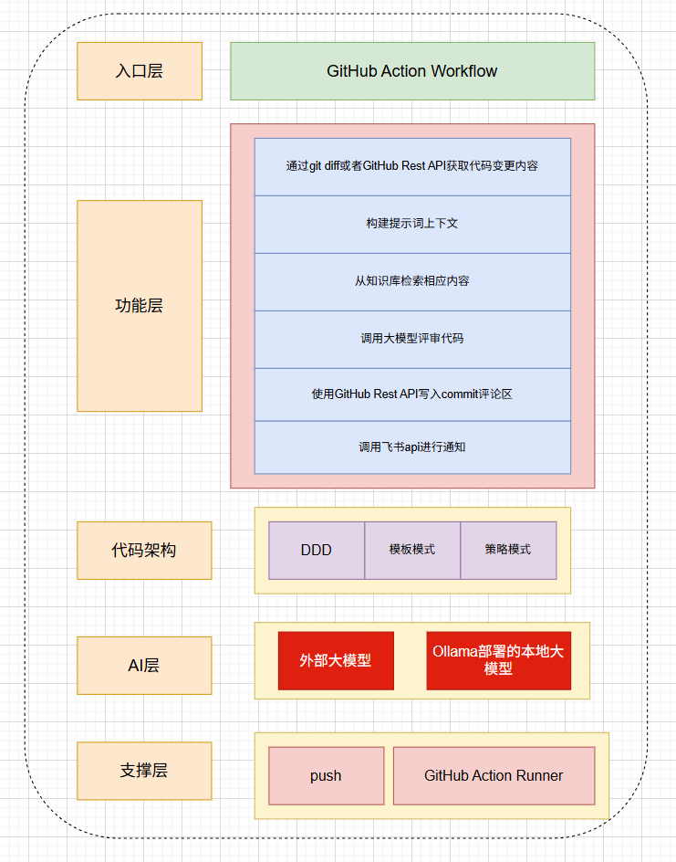
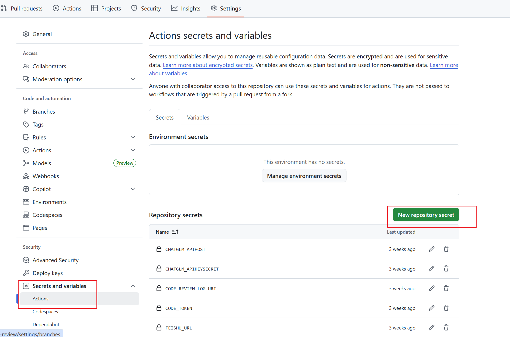

# code-review 代码自动评审

## 项目概述：

这是一个通过GitHub Actions做的代码自动化评审系统。其核心目标是提高代码交付质量。


## 项目架构：




## 主要功能：

- 代码自动评审：

  当代码提交到GitHub时，系统会自动触发代码评审。

- 抽象大模型对接：

  使用多种设计模式抽象大模型对接，可以按照标准的约定来实现不同大模型对接的接口的实现

- 提示词上下文构建：

  已实现上下文构建能力，例如根据不同的评审文件类型构建上下文，根据代码变更后新代码的上下文去构建提示词

- 评审结果标准化：

  可以为AI大模型指定评审结果结构，确保AI每次评审出的都是你想要的。

- 评审日志记录：

  评审结果会被记录到指定的GitHub仓库或本次Commit的评论区，方便后续查阅和分析。

- 通知：

  目前接入微信公众号和飞书，可以动态切换通知地，实现评审结果的实时推送。


## 使用步骤：

**拉取代码**

```
git clone git@github.com:iYaovo/code-review.git
```

拉取代码后可以在code-review-sdk下进行开发，定制属于你的代码评审工具。


**工作流**

在你想自动评审的项目根目录下创建.github/workflows文件夹，在内部编写yml文件，这样就可以在代码提交时发起评审。


**yml文件**

想了解yml文件如何编写可以看官方文档[GitHub Actions](https://docs.github.com/zh/actions)，想直接使用别人的工作流可以到[Marketplace](https://github.com/marketplace)查阅。

或者直接使用我的yml文件

main-maven-jar.yml：当代码提交时，mvn构建项目为一个jar包并java jar运行触发。

main-remote-jar.yml：当代码提交时，拉取远程保存的jar包并触发评审。


**配置secret**




yml文件中大量配置信息需要在图片中位置配置


## 后续更新计划：

[RAG知识库](https://github.com/iYaovo/ai-rag-knowledge)已实现，可以结合知识库精准化评审

后续会实现Server端，可以在线提交代码或者选择代码库进行评审，并且会实现一些MCP和Agent功能。